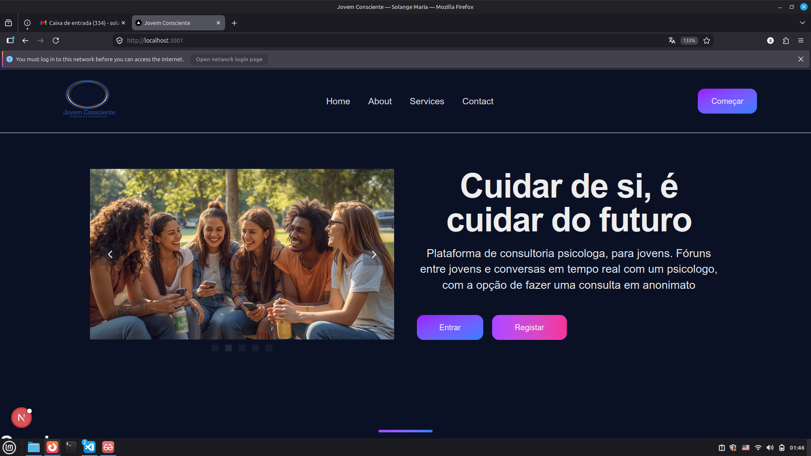
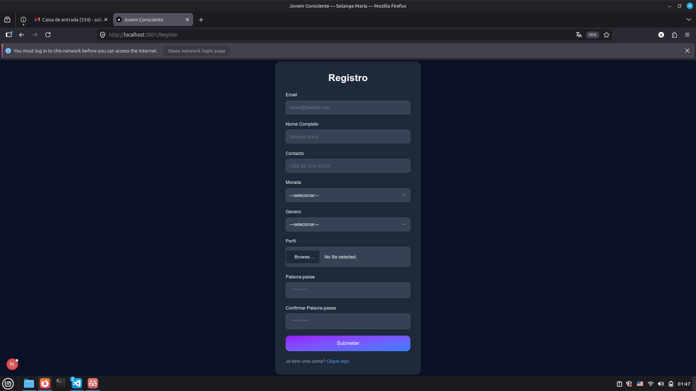
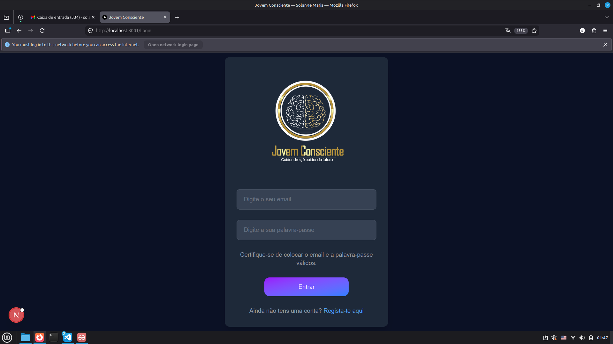
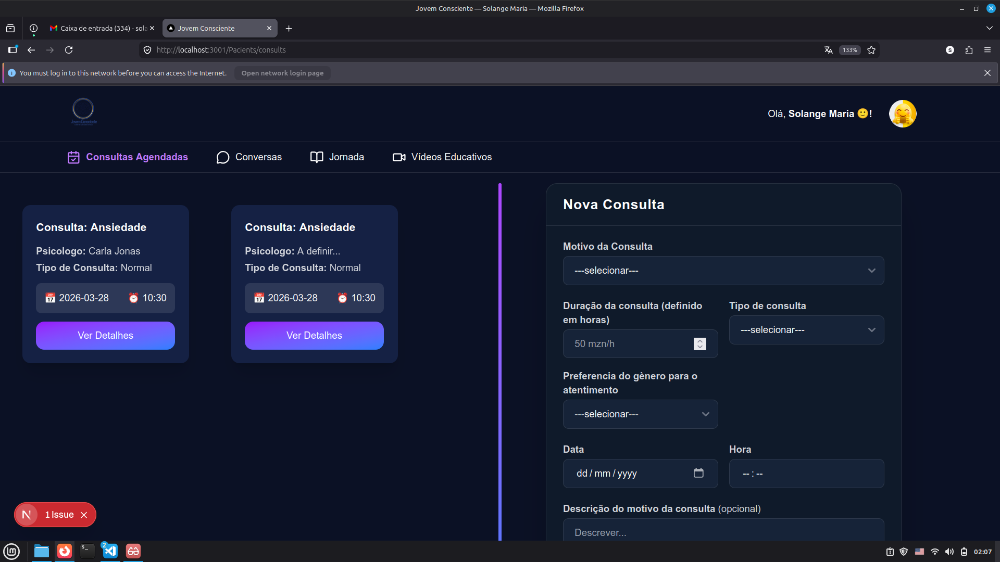
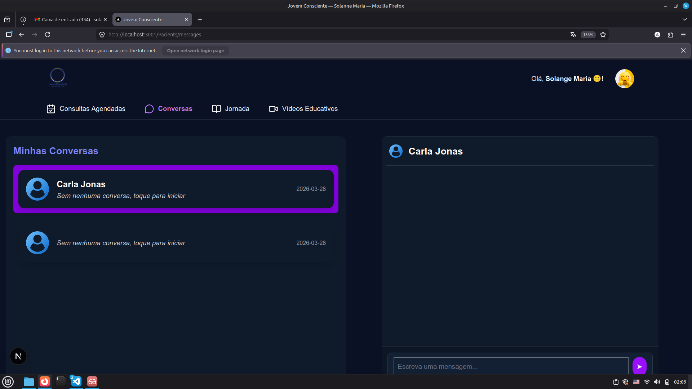

Jovem consciente - Frontend

Esta aplicação, foi desenvolvida no âmbito do projecto Hackathon que tem como objectivo facilitar as consultas psicologas, dando a psicologos e pacientes um ambiente confortável e acessivel paa consultas em tempo real.

## funcionalidades
1. registo de pacientes e psicologos
2. autenticação
3. marcação de consultas
4. confirmação de consultas
5. visualização de consultas agendadas

## Layout

